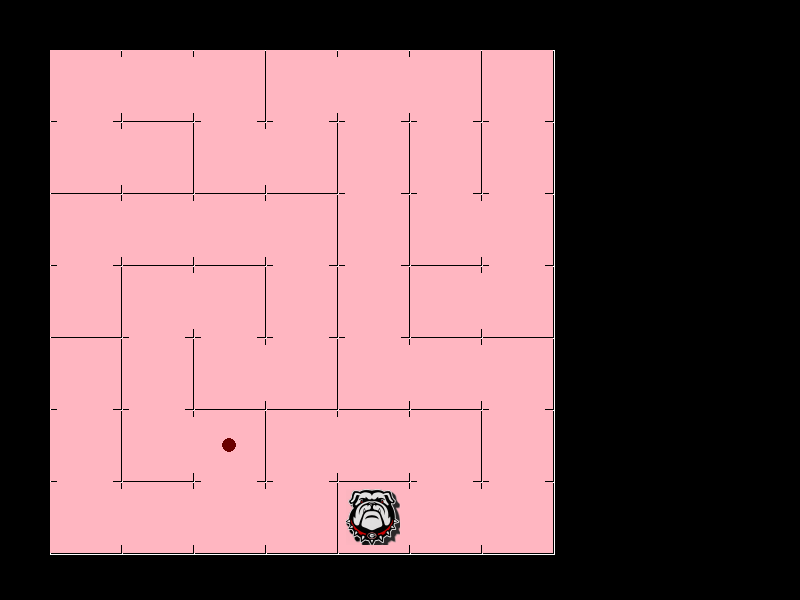

# MazeGen 
MazeGen is a small app done by using Pygame. The original idea is to create a demo for deploying something for a depth-first search algorithm. But I thought that
generating a maze would be cool, so I did a little bit of reading about how mazes can be generated by a computer. The algorithm for this one is done by applying
the **backtracking** algorithm to traverse all cells in a 2D grid. The algorithm itself only takes less than 50 lines. The majority part in this code is animating
the procedures.

test_maze.png
## Basic Requirement
Pygame module is required. You can use ```pip3 install pygame``` to install the module. And that's all you need.
## How to interact
Once you saw the Pygame windows pops up on your screen, you can do the following:  
Hit ```Space``` key for stepwise see how grids are traversed  
Hit ```A``` key for an automated animation on how grids are traversed  
Hit ```P``` key to play with the maze  
Once you close the window, there will be a screenshot of the final status of the maze
## How to adjust maze size
Change ```grid_x``` and ```grid_y``` to the size you want. However, there might be limits (mostly due to display issues)  
The random.seed was set for debugging purposes, so feel free to comment those out to get much more randomly results that surprise you  
I haven't cleaned the debugging messages, which were all ```print()```. Feel free to comment those out if it bothers you.  
To acquire the symbolic version of the maze in a plain text file. Please use standard I/O ```python3 MazeGen.py > OUTLOG``` to save the related information.  

### FOR IOB ALGORITHM
Happy Coding! Hope you like the bulldog. Woo.....f
